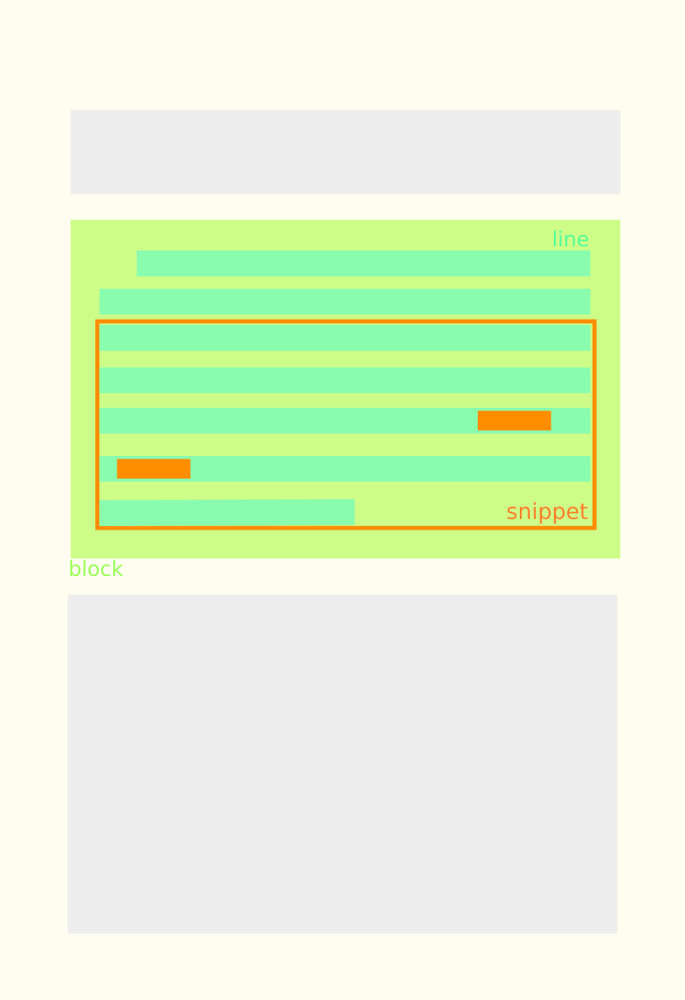

You can customize the way the passages are formed. By default the passage will include two lines above and below the
line with the match. Passages will also not cross block boundaries (what this translates to depends on the format).
These parameters can be changed at query time:

- `hl.ocr.contextBlock`: Select which block type should be considered for determining the context. Valid values are
  `word`, `line`, `paragraph`, `block` or `page` and defaults to `line`.
- `hl.ocr.contextSize`: Set the number of blocks above and below the matching block to be included in the passage.
  Defaults to `2`.
- `hl.ocr.limitBlock`: Set the block type that passages may not exceed. Valid values are `none` `word`, `line`,
  `paragraph`, `block` or `page`. This value defaults to `block`, which means that **snippets crossing page boundaries
  are disabled by default**. Set the value to `none` if you want to enable this feature.
- `hl.ocr.pageId`: Only show passages from the page with this identifier. Useful if you want to implement a
  "Search on this page" feature (e.g. for the [IIIF Content Search API](https://iiif.io/api/search/1.0/)).
- `hl.ocr.absoluteHighlights`: Return the coordinates of highlighted regions as absolute coordinates (i.e. relative to
  the page, not the snippet region)

To demonstrate the effects of the `contextBlock`, `contextSize` and `limitBlock` parameter, consider this image which
visualizes how a snippet with two highlights on adjacent lines is built when `contextBlock=line`, `contextSize=2` and
`limitBlock=block`:

First of all, the snippet size is determined by selecting `contextSize=2` blocks of type `contextBlock=line` above the
first highlight and below the last highlight in the snippet. In this example, there is only one `line` block remaining in
the containing `block`. Since the `limitBlock` parameter is set to `block`, the snippet ends here, the next line from
the next block is not included in the snippet.